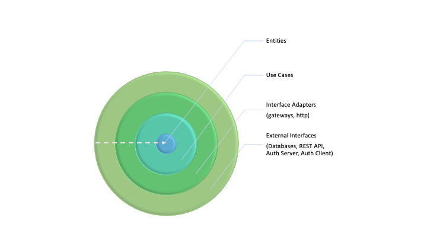

# Introduction

Rent a Car is a a software system for car rental companies that want to allow their users to rent cars online. This is merely a _Proof of Concept_ because it was created with the sole purpose of applying Clean Architecture [1].  

## Domain Model

The following domain entities are currently defined:

- Vehicle;
- Renter;
- Location;
- Reservation.

`Vehicle` represents any vehicle which can be rented. It has a type (e.g.: Economy Car), a brand (e.g.: Ford) and a model (e.g.: Ranger). It is also associated with a physical location from where it can be rented.

`Location` denotes a physical location, which has a name and a postal address.

`Renter` is somebody who can rent a vehicle. It's our main Rent a Car user.

`Reservation` holds the information about a reservation made for a vehicle. 

## Use Cases

The following use cases are developed:

1. Search Vehicles;
1. Rent Vehicle;
1. Retrieve Locations;
1. Register Location;
1. Register Vehicle;
1. Register Renter.

The first two use cases are the main ones. They allow renters to search for vehicles that are available for renting (in the given time period) and to rent a vehicle.  
The Retrieve Locations use case allows the system to retrieve all the locations from where rented vehicles may be picked up or returned.  
The Register Location and Register Vehicle use cases are currently used only internally, to input data into the system.  
The Register Renter use case allows users to register themselves into the system.

The developed functionality is obviously limited. For example, we do not define the payment mechanism(s). Another example is that a vehicle can be picked up from a certain location but, it can be dropped to any of the available locations.  
The design can also be considered too simple or even flawed. This project focuses on applying Clean Architecture.

# Architecture

This software system adopts the Clean Architecture (also known as Ports and Adapters).

Clean Architecture is presented at [https://8thlight.com/blog/uncle-bob/2012/08/13/the-clean-architecture.html]()  
The Clean Architecture book [1] is a highly recommended reading as it gives the reader a much thorough understanding.

This type of architecture has the following advantages:

- Independent of frameworks;
- Testable;
- Independent of UI;
- Independent of Database;
- Independent of any external agency.
- The Entities (Enterprise wide business rules) and the Use Cases (application specific business rules) are at the core of the software system. Databases, UIs, frameworks are details.

Therefore, this software system has:

- Entities;
- Use Cases;
- Interface Adapters;
- External Interfaces.

There are two Interface Adapters. `gateways` provides an JDBC-based database interface. `http` exposes Use Cases for a communication using the HTTP protocol.  
For these Interface Adapters we have corresponding External Interfaces: databases and a REST API. (They are called External because they are accessible from the outside of the software system).  
There is an H2 database because it was used in the initial development and also in unit tests.  
There is also a PostgreSQL database because the project was deployed in Heroku (and their free plan provides just this database).  
We also use OAuth2 for security purposes. Using the Spring framework, we have a simple OAuth2 server and a simple OAuth2 client.  
The Rent a Car user interface is the OAuth2 Client.

This software system uses Spring for external interfaces. But Spring is merely a tool. This kind of architecture allows us to drop Spring should we need or want to.  
Spring JDBC is indeed used in the gateways for the database. Plain JDBC should have been used instead. This can be consider a mistake because our interface adapter for databases is really JDBC.   

Some potential disadvantages of this kind of architecture, are, in my opinion:

- perceived duplication of code; (We are actually favouring decoupling over Do not Repeat Yourself.)
- learning curve. (It takes some exercise to get familiar with this kind of style.)

# REST API Usage Example

See [REST API README.md](application/external-interfaces/rest-api/README.md).

# How to Run

We have three Spring Boot applications that we need to start.

## Using Gradle

1. _OAuth2 Server_: `./gradlew application:external-interfaces:auth-server:bootRun --args='--spring.profiles.active=local'`

2. Rent a Car _REST API_: `./gradlew application:external-interfaces:rest-api:bootRun --args='--spring.profiles.active=local --init-db=false --DB_URL=jdbc:postgresql://localhost/rent_a_car --DB_USER=postgres --DB_PASSWORD=postgres'`

3. _OAuth2 Client_ (Rent a Car User Interface): `./gradlew application:external-interfaces:auth-client:bootRun --args='--spring.profiles.active=local --init-db=false'`

Rent a Car has two databases:

- the users (and their roles), kept in the OAuth2 Client;
- the Rent a Car data, kept in the REST API.

If this is the first time you start the application, set `init-db` VM argument to `true` (for _REST API_ and _OAuth2 Client_).

## From your IDE

Create one launch configuration for each of the three Spring boot Applications.
Use the following VM arguments:

1. -Dspring.profiles.active=local

2. -Dspring.profiles.active=local -DDB_URL=jdbc:postgresql://localhost/rent_a_car -Dinit-db=false -DDB_USER=postgres -DDB_PASSWORD=postgres

3. -Dspring.profiles.active=local -Dinit-db=false

# Development Practices

Please read the [How to Contribute](./CONTRIBUTING.MD) guide.

# Deployment

This software system requires Java 8 and an Internet connection (for downloading third party dependencies).
This software system uses [Gradle](https://gradle.org/). Specifically, we use the [Gradle Wrapper](https://docs.gradle.org/current/userguide/gradle_wrapper.html), which allows the automatic download of the specified Gradle version.

Rent a Car can be deployed locally or on Heroku.
We are using Spring Profiles as an extension point for various types of deployment.
Locally the Web Application runs at [http://localhost:8080](http://localhost:8080). The REST API is on port `7082`. The OAuth2 Server is on port `7081`.

# Useful Gradle Commands

1. `./gradlew clean build`

2. `./gradlew dependencyUpdates -Drevision=release`

3. `./gradlew clean build jacocoRootReport`

# References

1. Clean Architecture: A Craftsman's Guide to Software Structure and Design (Robert C. Martin Series), https://www.amazon.com/Clean-Architecture-Craftsmans-Software-Structure/dp/0134494164
